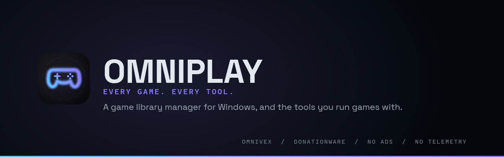

  

  
  &nbsp;
  

  <b>Every game you own, in one place — and the tools you run them with.</b>

---

OmniPlay finds the games you already have — across Steam, Epic, GOG, Battle.net, EA, Ubisoft, Xbox,
Amazon, Rockstar, emulators, and plain folders on a drive — and puts them in one library. Then it
does the part a launcher usually leaves to you: it installs and tracks **ReShade, Special K and
DXVK** per game, and tells you what each game already has.

It is a fork of [Playnite](https://github.com/JosefNemec/Playnite) by Josef Nemec, rebuilt on
**.NET 10, 64-bit**, with the jobs that mattered most built in rather than bolted on.

**Donationware.** Free, complete, no ads, no paid tier, nothing held back.

  

---

## What it does

|  | |
|---|---|
| **Mod and graphics tools per game** | ReShade, Special K and DXVK installed into a game's folder from inside OmniPlay, with a badge in the library for what each game already carries. |
| **Store scanning without signing in** | Eight store clients read from their own local manifests. No login, no token, no session cookie. |
| **Every launcher in one library** | The nine upstream library plugins are bundled too, for the extras only a signed-in account can give you. |
| **A folder scanner** | Point it at `X:\Games\` and games installed outside any launcher become first-class library entries. |
| **A discovery layer** | Store catalogue search, current deals, a wishlist with price alerts, and a release calendar. |
| **Emulation that can name a ROM** | The 108-platform ROM database that upstream packages outside its source tree, and that source builds therefore never had. |
| **Metadata from ten providers** | IGDB, SteamGridDB, PCGamingWiki, IGN, GOG, Xbox, PSN, Steam, Steam Tags, and local files. |
| **Fullscreen mode** | Including the quick access menu and handheld layouts. |
| **45 languages** | Inherited from a decade of upstream translation work. |

---

## The mod tools are the point

Every other launcher stops at "here is your game". OmniPlay knows what is *inside* the game folder.

  

The library badge can only say yes or no. The game page's **Mods** tab says which tool, which
version, and which file name it loads under — the answer you need when two tools want the same
proxy DLL.

Versions are resolved from each tool's **own release feed at the moment you install**, never pinned
to whatever was current when the build was made. DXVK is refused for games that do not use Direct3D
8–11, and refused alongside ReShade or Special K, because it replaces Direct3D rather than layering
on top of it — with the reason on the greyed-out row instead of a silent failure.

---

## A game page, not a spreadsheet

  

Key art as the page's own backdrop, the trailer playing in the same place if the game has one, and
three tabs instead of one endless scroll: **Overview** for the four numbers you actually came for,
**Details** for the other twenty-one fields and every link, **Mods** for what is installed.

  

---

## It does not touch your Playnite install

OmniPlay keeps its library in `%AppData%\OmniPlay` and its program files in `%LocalAppData%\OmniPlay`.
Playnite's own `%AppData%\Playnite` is **never read and never written**. Both programs can be
installed and run at the same time; on the development machine they are.

Your library is copied and converted on first run. The original is left alone.

Your existing **plugins and themes keep working**: the SDK assembly is still `Playnite.SDK` with
unchanged namespaces, on purpose.

---

## Privacy

Your library lives on your PC. **No telemetry, no usage reporting, no account, no crash upload.**

Playnite's crash handler uploads a diagnostics package to its own server. OmniPlay writes the package
next to you and opens the folder instead — your logs stay on your machine.

OmniPlay contacts the network only when a feature you used needs it: a metadata provider you asked
to download from, a store plugin you enabled, the add-on index when you browse add-ons, the release
feed of a graphics tool at the moment you install it, and the discovery surfaces if you gave them
keys.

Those keys are **yours**. The catalogue reads IGDB and the prices read IsThereAnyDeal; both are free
and both need an account of your own. They are stored in **Windows Credential Manager**, never in a
settings file. OmniPlay ships no keys of its own, and those surfaces do nothing until you add yours.

See [PRIVACY.md](PRIVACY.md).

---

## Getting it

**There is no public download yet.** OmniPlay is finished enough to use daily and is being used
daily — but it has not been through anyone else's hands, and a first release that has only ever run
on one machine is not a release.

Builds go to supporters first, the same way the rest of the OmniVex tools are handled:

  
  &nbsp;&nbsp;
  

**Requirements:** Windows 10 or 11, 64-bit. The runtime ships with the app — no separate .NET
install.

This repository is the project's front page. **The source code and the installer are not here**, and
that is deliberate.

---

## Part of OmniVex

> Tuned for framerate, mixed for headroom, sharp to the pixel.
> Donationware tools for gamers and audiophiles — audio, graphics, and a bit of privacy too.

More at [github.com/TheOmniGrid](https://github.com/TheOmniGrid).

---

## Credit

OmniPlay is a fork of **[Playnite](https://github.com/JosefNemec/Playnite) 10.56** by **Josef Nemec**,
MIT licensed, and would not exist without roughly a decade of his work and that of Playnite's
contributors and translators.

**Playnite is a separate, actively developed project. Please do not report OmniPlay problems to it** —
its maintainers have never seen this code. Its [user manual](https://playnite.link/docs/) is theirs
and still largely applies.

Full attribution in [CREDITS.md](CREDITS.md).

---

## Contact

Issues are closed here — this is a personal project published for people who want to use it, not one
taking patches. If something is broken, say so:

**omnivex@theomnigrid.biz**
